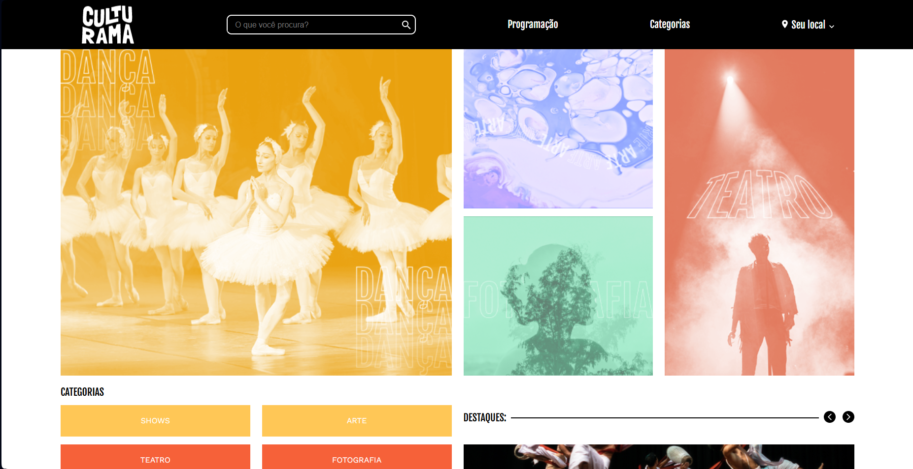

**✨ Título do Projeto: Culturama ✨**

**📖 Descrição:** Uma breve descrição do projeto, como "Um site moderno e responsivo para apresentar informações culturais, construído com Grid e Flexbox".

**⚙️ Funcionalidades:**

* 📱 Layout responsivo que se adapta a diferentes tamanhos de tela.
* 🧱 Estrutura de grade complexa para organizar o conteúdo de forma eficiente.
* ↔️ Alinhamento e distribuição de elementos utilizando Flexbox.

**💻 Tecnologias Utilizadas:**

*  HTML
* 🎨 CSS
* 📐 Grid Layout
* 📦 Flexbox

  ## Veja o AluraBooks em Ação\! 👀

**🙏 Créditos:**

Agradeço aos instrutores do curso (Beatriz Moura e Luan Alves) pelo aprendizado.
